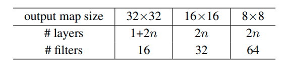
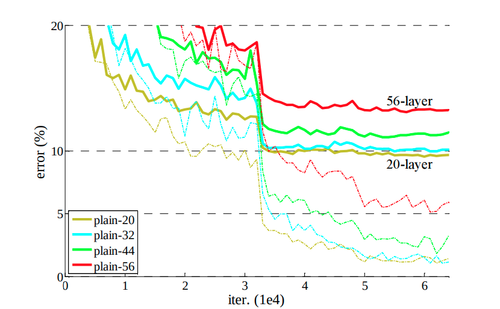
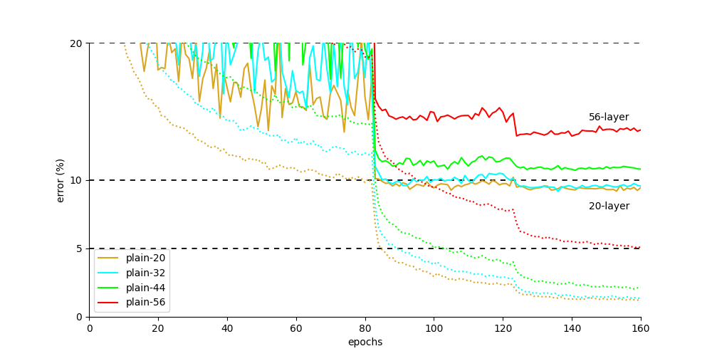
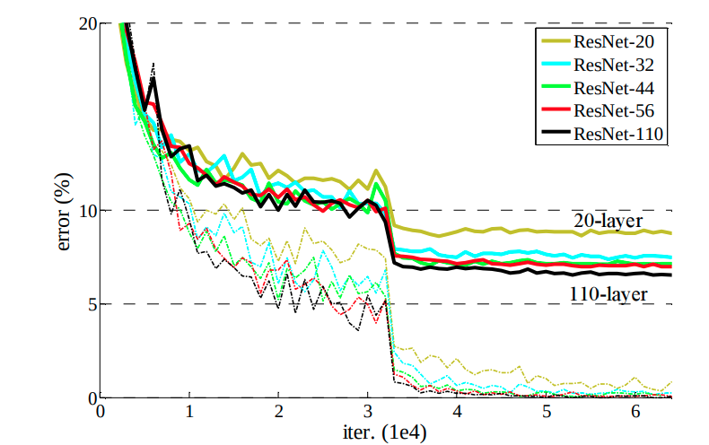
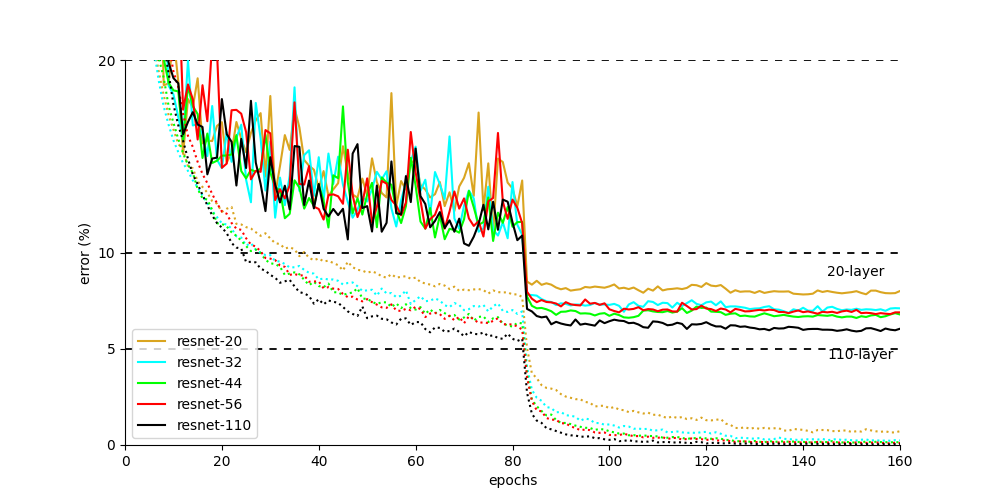

# Resnet on CIFAR10 dataset

Pytorch implementation of ResNet from http://arxiv.org/abs/1512.03385

### Ⅰ. Architecture



| n | # Layers | # Parameters |
|:-:|:--------:|:------------:|
| 3 |  20 | 0.27M |
| 5 |  32 | 0.46M |
| 7 |  44 | 0.66M |
| 9 |  56 | 0.85M |
| 18 |  110 | 1.7M |

<br>

### Ⅱ. Train Methodology (as original paper)

- [x] The network inputs are 32×32 images, with the per-pixel mean subtracted.
- [x] Use a weight decay of 0.0001 and momentum of 0.9.
- [x] These models are trained with a minibatch size of 128.
- [x] Start with a learning rate of 0.1, divide it by 10 at 32k and 48k iterations, and terminate training at 64k iterations, which is determined on
a 45k/5k train/val split.
- [x] We follow the simple data augmentation for training: 4 pixels are padded on each side, and a 32×32 crop is randomly sampled from the padded image or its horizontal flip.
- [x] For testing, we only evaluate the single view of the original 32×32 image.
- [x] In case of n = 18, use 0.01 to warm up the training until the training error is below 80% (about 400 iterations), and then go back to 0.1 and continue training.

<br>

### Ⅲ. Train

```
python train.py configs/train.yaml
```

<br>

### Ⅳ. Plot result

```
python plot_log.py configs/plot-plain.yaml
python plot_log.py configs/plot-resnet.yaml
```

<br>

### Ⅳ. Results

| # Paper | # Implimentation |
|:-------:|:----------------:|
|   |  |
|   |  |
